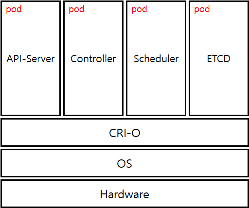
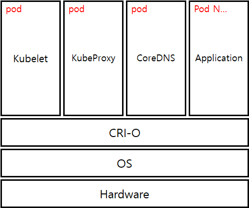
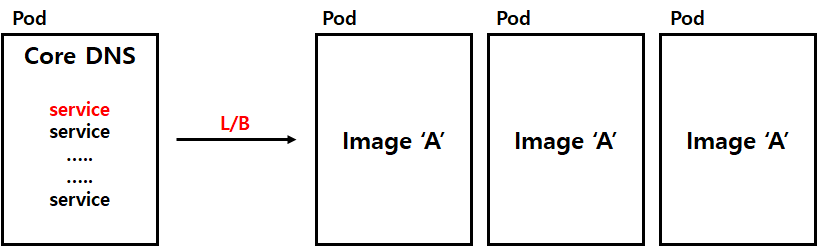
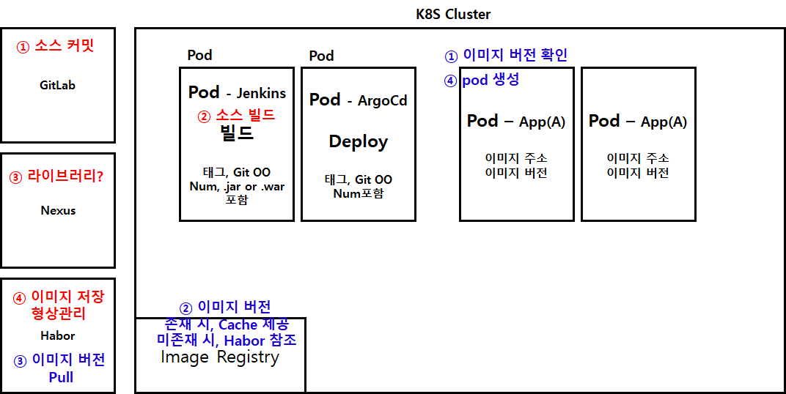

# Question

**#. Bootstrap json 파일 확인하기**

- Bootstrap, 테라폼을 통해 Openshift 기반의 k8s cluster 구축
- k8s cluster를 구축한다는 의미(Openshift에서 Component를 구축함) 
→ Master Node Component Setup  
→ Workder Node Component Setup  
→ Other... ( k8s cluster 기본 설정)  
실제 테라폼 파일을 분석하자.

**!!!! Setup이 아니다.**  
→ Component Pod를 올리는 것 !  
k8s cluster 구축 시, Component Pod로 올라간다.

**Master Node,**  

**Worker Node**  

**#. ETCD - pod Service**

ETCD의 경우 1,3,5,7,9...로 세팅이 가능하다.  
ETCD는 가용%가 51%가 넘어야 되므로 2개를 세팅할 수 없다.  
따라서 Master Node도 1,3,5,7,9 형식으로 통상적으로 세팅된다.

**#. Pod들 간의 통신**

- Worker Node에는 KubeProxy Component가 존재한다.
- **CoreDNS(Service N → L/B → pod)**  
**→ 이거 맞는지 다시 확인해야함.**  

**#. Bastion의 역할?** 

Bastion은 사실 private-cloud라면 필요없다.  
public-cloud일때, 보안상 내부망을 접속하기 위한 Server이다.  
Kubectl, Dokcer 등 CLI를 날려서 K8S Cluster와 통신하며 이를 제어한다.

**#. Logging EFK - pod 구성**
- OpenShift 환경에서, fluetd / elasticsearch / kibana는 각각의 pod로 서비스한다.
- 굳이 여러개의 Container를 생성하여 하나의 pod로 띄울 필요가 없음.  
→ 통상적으로 1pod-1container로 구성한다.

**#. Logging EFK - 이중화 구성**

- EFK를 예로 들어 설명한다.
- Replica set은 하나로 설정되어있는 환경이지만, 이중화 구성이 가능하다.
- 리소스를 할당하여 장애를 대비한다.
- ElasticSearch의 경우, Data를 저장해야하며 할당된 Disk에 저장한다.  
→ 이를 Rook Chef를 통해 분산 스토리지로 Worker Node에 Logical하게 Storage를 관리한다.  
Leader / Follow의 개념이 아닌 무조건 Storage 동기화함.
- 1개의 Worker Node에서 1 pod가 생성되는 것이 원칙이며, 다른 1개의 Worker Node의 1 pod는 Resource가 잡힌상태에서 대기한다.(active-inactive 방식이 아니라 active-active 방식임)
- 1개가 동작될때, 다른1개가 동작하지 않는 방식이지만 모두 서비스된다.

**#. Replica**

- pod 생성 시에는 무조건 image Registry에서 가져와 pod를 띄운다.  
→ 만약 Server local memory에 image가 적재되어 있다면, cache한다.
- 하나의 image에 대한 여러 개의 pod가 동시에 죽는다면, k8s cluster 내 replica set에 따라 띄울려고 한다.

**#. CI/CD - Step.. 어려워**

**#. Doker - Container Engine 쓰지 않는 이유**

1. 무겁다.
2. Doker demon이 죽으면 모든 pod가 죽는다.

**→ CRI-O는 demon이 죽어도 pod에 영향을 주지 않는다.**