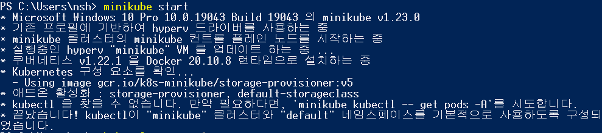

# 2021.09.07, Day-7

[Question](2021%2009%2007,%20Day-7%207d04533b894e423f8821e377c5128209/Question%20b191b509955d4be38029f6b3b8b4023e.md)

**#. minikube** 

**1. minikube .exe download**

[https://minikube.sigs.k8s.io/docs/start/](https://minikube.sigs.k8s.io/docs/start/)

**2. minikube driver**

If minikube fails to start, see the drivers page for help setting up a compatible container or virtual-machine manager.

[https://minikube.sigs.k8s.io/docs/drivers/](https://minikube.sigs.k8s.io/docs/drivers/)

**<hyper-v>**

[https://minikube.sigs.k8s.io/docs/drivers/hyperv/](https://minikube.sigs.k8s.io/docs/drivers/hyperv/)

**3. minikube Dashboard**

**#. ubuntu 환경에서 k8s cluster 구축 및 서비스 올려보기.**

**1. Ubuntu 설정**

> swapoff -a (/etc/fstab swap comment out)  
> systemctl stop ufw && ufw disable && iptables  

→ OS 방화벽 사용하지 않음

**2. ubuntu Docker Install**

docs.docker.com/engine/install/ubunthu  
systemctl enable docker  
→ 항상 떠있어야해서 enable 시켜야함   

docker images  
docker ps  
→ kube를 설치하고 배포해야 image를 볼 수 있음

**3. kubernetes 설치**

kubeadm - kube를 클러스터로 관리하기 위함  
kubelet - Master API와 통신하기 위한 CLI  
kubectl - Container 통신 CLI   

Creating a cluster  
kubeadm init —pod-network  
Server의 host를 자동할당함.  
→ service에 대한 대역을 어떻게 가져갈것인가.  
→ 원래 option을 넣어서 cluster 구성함.   

1대의 vm으로 master node와 worker node 역할을 할끼다.  
실제 k8s는 docker를 어떻게 잘 관리할것인가가 포인트이다.   

Kube config 파일 생성 및 권한 부여  
→ config 파일로, k8s api server 정보가 들어가 있다. token, ip 등등  
→ bastion에 config 파일을 설정해서 api server와 통신한다고 보면된다.  

**#. Container 들끼리 통신할 수 있는 건 ooo을 깔아줘야한다.**

추가적으로 배포를 해주어야함.(calico.yaml) - CNI(Container Network Interface)  

→ kubectl apply -f "https://"  
→ CNI가 Triggrr 역할을 한다.  

**#. vi .bashrc custom use**

kubectl → k  
tab으로 자동완성 기능도 가능  

**Taints clearing**

**Taints** : 조건에 맞는 옵션을 추가로 넣어야 해당 node에 배포를 할 수 있다.  
master 같은 경우 Taints 설정이 되어있다.  
pod들을 Master에 배포해야하기 때문에 Taints 옵션을 clear 해야한다.  
etcd 등 중요한 정보에 대한 리소스 할당 보호를 해야하기 때문에 Master Node는 default로 Taint 정보가 있다.  
지금은 1개의 서버에 Master Node, Worker Node가 같이 있는 구조이므로 Taint설정을 clear해야한다.  

k taint node ip.......  
deployments  
배포할 때, 가장 많이 사용한다.  
Pod보다 상위 개념  
Pod에서 Replica - Set을 얼마나 주는지  
Rolling-Update 개념까지 포함된게 deployments   

yaml File 배포  
controllers/nginx-deployment.yaml  
selector - 어떤 정보를 가지로 l/b를 해줄꺼냐.  
selector-matchLables-app  
k create nginx.yaml   

실제 서비스를 하기 위해서는 앞에 service를 배포해야함
service  
Type 4가지  
- Cluster IP : 클러스터 내부 통신(type 미설정 시, default)
- NodePort : 클러스트 외부 통신  

selector : ngnix 라고 되어있는 pod에만 network-traffic을 보내라고 정의  
k get deployments.apps -o wide  
k create -f service.yaml  
k get svc  

**→ 해당 서비스는 coreDNS Service와 일절 연관이 없다**

pod 배포하면 service를 붙여야한다.  
그럼 1 image(deployments) 당 1service?  

systemctl restart sshd  

**#. To do**

1. Application 실행해보기 (ngnix)  
지금 왜 실행이 안될까.?  
→ public cloud(EC2)에서는 Cluster-IP로 외부망에서 접속이 불가능함.  
10.107.134.218:30596  

2. 주요 명령어 학습  
**kubectl get pod**  
**kubectl get pod -n kube-system**  
**kubectl get pod -A**  
**kubectl get pod -A -o wide**

[**https://kubernetes.io/ko/docs/reference/kubectl/cheatsheet/**](https://kubernetes.io/ko/docs/reference/kubectl/cheatsheet/)

3. Application 올려보기  
→ 성공

**#. DB - Client Server**

DB Server 앞단에 Client Server를 연결시켜 관리하도록 함.  
1. 권한 관리가 쉽다.  
2. 여러 종류의 DB를 한번에 Control 가능하다.  
3. 보안적인 측면이 강해진다.  