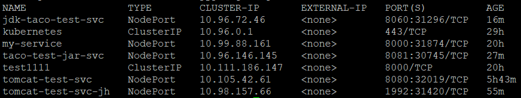
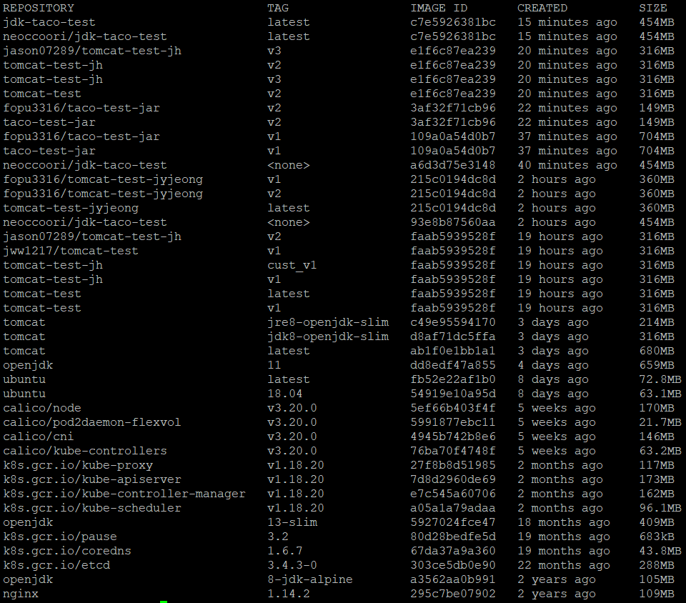

# 2021.09.08, Day-8

**#. jar File Image push → pod 생성**

Spring-in-action5 study jar → [https://github.com/skyshop300/DockerTest](https://github.com/skyshop300/DockerTest)

<br>

**step1. Image Check / Command : docker images**



<br>

**step2. Image Build**

docker build -t(tag) [imageName]:[tag]

<br>

**docker build -t taco-test-jar:v2**

→ 현재 Directory(pwd)에 있는 경로에 정의된 Dockerfile을 기준으로 Image를 Build한다.

```yaml
FROM openjdk:8-jdk-alpine
COPY ./taco.jar app.jar
ENTRYPOINT ["java","-jar","/app.jar"]
```
—> CRI-O 에서는 podman cli 사용

<br>


**step3. Image run test**

docker run [imageName]:[tag]

<br>

docker run taco-test-jar:v2

<br>

**step4. Image push**

docker login / docker logout <br>
docker push [imageName]:[tag] <br>
docker push taco-test-jar:v2 <br>

<br>

**step5. Create Deployments** 

yaml File을 이용하여 Deployments를 등록한다. <br>
yaml File 내 push 했던 Image를 docker hub에서 가져온다.

```yaml
apiVersion: apps/v1
kind: Deployment
metadata:
  name: taco-test-jar
  labels:
    app: taco-test-jar
spec:
  replicas: 2
  selector:
    matchLabels:
      app: taco-test-jar
  template:
    metadata:
      labels:
        app: taco-test-jar
    spec:
      containers:
      - name: openjdk
        image: fopu3316/taco-test-jar:v2
        ports:
        - containerPort: 8081
```

<br>

**step6. Create svc**

yaml File을 이용하여 Servcie를 등록한다. <br>
port : 내부 서비스 port <br>
targetPort : 서비스 default port <br>

```yaml
apiVersion: v1
kind: Service
metadata:
  name: taco-test-jar-svc
spec:
  type: NodePort
  selector:
    app: taco-test-jar
  ports:
    - port: 8081
      targetPort: 8080
```

**step7. Service port check**

svc port 확인 후 real-service 확인

