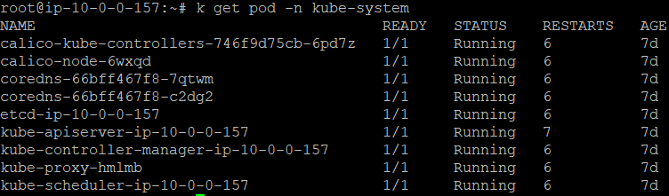
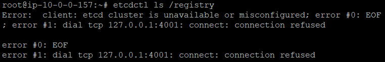

# 2021.09.14, Day-12

**#. 쿠버네티스 인 액션 - Chapter11.쿠버네티스 내부 이해**

**p-479**  
kube-proxy와 같은 구성 요소는 파드로 실행할 수 있다고 했는데, kubelet은 무조건 시스템 구성 요소(데몬)로 실행돼야 한다.  
→ 왜 pod로 실행하면 안되는거지?  

 

**★ 실제 kube-system pod 구성**  

 

**p-481**  
etcdctl ls /registry  
→ 이거 왜 안되지.

 

**p-483**  
etcd는 RAFT 합의 알고리즘을 사용해 어느 순간이든 각 노드 상태가 대다수의 노드가 동의하는 현재 상태이거나 이전에 동의된 상태 중에 하나임을 보장한다.  
→ deployment가 등록/수정되는 순간 etcd에 올라가니깐 당연한 얘기아닌가?  
→ etcd들끼리 얘기하는것임 !  

 

**p-488 / 그림 11.4**  
오브젝트가 갱신되면, API 서버는 갱신된 오브젝트를 감시하는 모든 관찰자에게 갱신된 오브젝트를 전달한다.  
→ 여기서 Client는 Controller Manager's Controller ?  
→ 이게 제일 합리적인 듯 하다.  

 

**p-491**  
수용 가능한 노드 찾기  
- 노드가 파드 정의 안에 있는 노드 셀렉터와 일치하는 레이블을 가지고 있는가?
- 파드가 노드와 파드의 어피니티, 안티-어피니티 규칙을 지정했는가?

