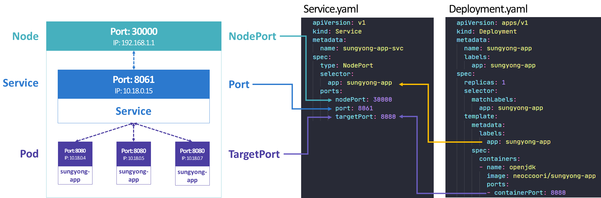

# Service.yaml설정 파일 정리

# #. type

- **ClusterIP** (default)
    - **클러스터 내부에서만 접근** 가능한 IP.
    - 서비스를 클러스터-내부 IP에 노출시킨다. 이 값을 선택하면 클러스터 내에서만 서비스에 도달할 수 있다.
- **NodePort**
    - Port번호를 통해 **외부에서 접근**. (NAT 컨셉)
    - **고정 포트 (`NodePort`)**로 각 노드의 IP에 서비스를 노출시킨다. `NodePort` 서비스가 라우팅되는 `ClusterIP` 서비스가 자동으로 생성된다. `**<NodeIP>:<NodePort>**`를 요청하여, 클러스터 외부에서 `NodePort` 서비스에 접속할 수 있다.
- **Load Balancer**
    - **외부의 Load Balancer**를 사용하는 방법.
    - 클라우드 공급자의 로드 밸런서를 사용하여 서비스를 외부에 노출시킨다. 외부 로드 밸런서가 라우팅되는 `NodePort`와 `ClusterIP` 서비스가 자동으로 생성된다.
- **ExternalName**
    - kube-dns 컴포넌트로 DNS를 이용하는 방법.
    - 값과 함께 CNAME 레코드를 리턴하여, 서비스를 `externalName` 필드의 콘텐츠 (예:`foo.bar.example.com`)에 매핑한다. 어떤 종류의 프록시도 설정되어 있지 않다.

## ##. NodePort

```yaml
apiVersion: v1
kind: Service
metadata:
name: my-service
spec:
type: NodePort
selector:
app: MyApp
ports:
# 기본적으로 그리고 편의상 `targetPort` 는 `port` 필드와 동일한 값으로 설정된다.
  - port: 80        # Service의 Port
		targetPort: 80  # Pod의 Port
		nodePort: 30007 		# 선택적 필드 # 지정하지 않으면 쿠버네티스 컨트롤 플레인은 포트 범위에서 할당한다(기본값: 30000-32767)
```

### ###. ports

port: Service 스스로의 port를 정의한다.

targetPort: 내부 Pod-Container와 통신하기 위한 Port를 정의한다.

- 통상적으로 Deployment.yaml의 `spec.template.containers.ports.containerPort`와 동일한 값을 갖는다.



## ##. **LoadBalancer**

```yaml
apiVersion: v1
kind: Service
metadata:
name: my-service
spec:
selector:
app: MyApp
ports:
    -protocol: TCP
port: 80
targetPort: 9376
clusterIP: 10.0.171.239
type: LoadBalancer
status:
loadBalancer:
ingress:
    -ip: 192.0.2.127
```

**참고:** 

[https://kubernetes.io/ko/docs/concepts/services-networking/_print/](https://kubernetes.io/ko/docs/concepts/services-networking/_print/)

# 방향성

---